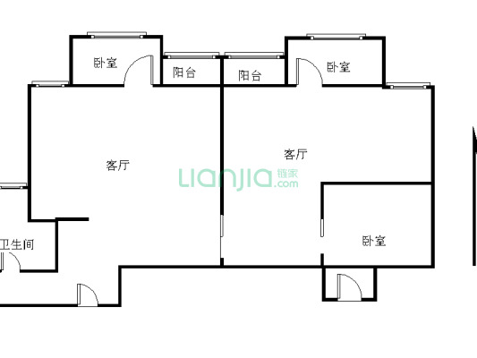

# 布吉站

`3号线`、`5号线`、`14号线（待开通）`、

### 两室

> [布吉街 美杜兰华庭](https://sz.lianjia.com/ershoufang/105104796445.html)，两室一厅

| 总价   | 单价  | 面积 | 朝向                  | 楼龄      |
| ------ | ----- | ---- | --------------------- | --------- |
| 276 万 | 41318 | 66.8 | 西南/精装/电梯/中(18) | 2005/板塔 |

```
首付：95.1 万，月供 9741 元
```


`5号线长龙站213米`、`5号线下水径984米`、`3/5号线布吉站1011米`、`木棉湾站1627米`

> [布吉关 百合星城一期](https://sz.lianjia.com/ershoufang/105103064573.html)，两室两厅

| 总价   | 单价  | 面积  | 朝向                | 楼龄      |
| ------ | ----- | ----- | ------------------- | --------- |
| 280 万 | 39183 | 71.46 | 南/精装/电梯/中(32) | 2005/板塔 |

```
首付：99.1 万，月供 9882 元
```



`3/5号线布吉站438米`、`5号线百鸽笼1070米`、`5号线长龙站1435米`、`木棉湾站1444米`

### 三室
