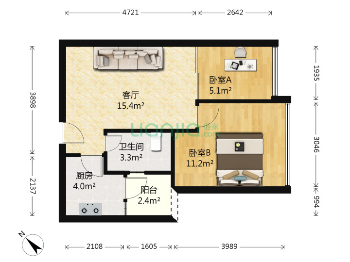

# 大运站

`3号线`、`16号线（待开通）`、`14号线（待开通）`、

## 两室

> 1.区域：[宝荷 中环至外环](https://sz.lianjia.com/ershoufang/105104494035.html)

| 总价   | 单价  | 面积 | 朝向                  | 楼龄      |
| ------ | ----- | ---- | --------------------- | --------- |
| 259 万 | 43312 | 59.8 | 东南/精装/电梯/高(33) | 2014/板塔 |

缺点：`无地铁/无学校`、`满两年`

> 2.[大运新城 THETOWN 乐城](https://sz.lianjia.com/ershoufang/105103790167.html)，两室一厅

| 总价   | 单价  | 面积  | 朝向                  | 楼龄    |
| ------ | ----- | ----- | --------------------- | ------- |
| 245 万 | 47426 | 51.66 | 东南/简装/电梯/中(33) | 2014/板 |

优点：`地铁3号线荷坳站374米、大运站1215米`、`学校配套完善`

缺点：`满两年`

## 三室

> 3.区域：[坪地 中骏四季阳光二期](https://sz.lianjia.com/ershoufang/105104573589.html)，三室两厅

| 总价   | 单价  | 面积  | 朝向                | 楼龄      |
| ------ | ----- | ----- | ------------------- | --------- |
| 290 万 | 32251 | 84.26 | 南/毛胚/电梯/高(31) | 2016/板塔 |

缺点：`无地铁`
