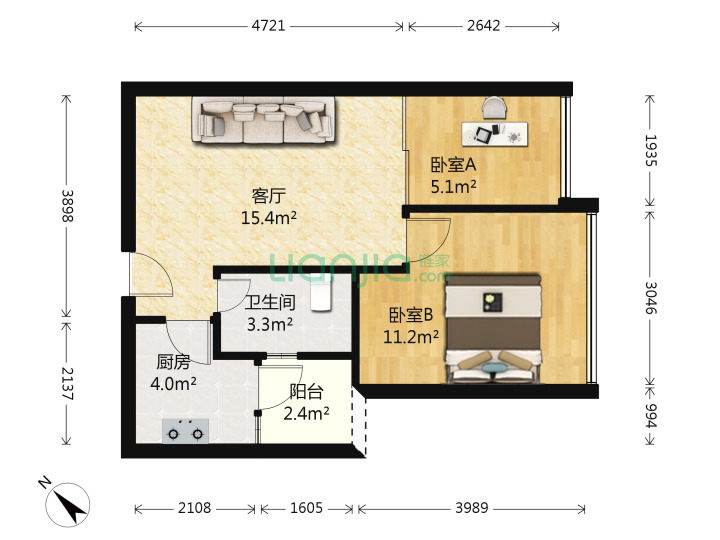

## 荷坳站

### 两室

> 2.[大运新城 THETOWN 乐城](https://sz.lianjia.com/ershoufang/105103790167.html)，两室一厅，`大运/荷坳`

| 总价   | 单价  | 面积  | 朝向                  | 楼龄    |
| ------ | ----- | ----- | --------------------- | ------- |
| 245 万 | 47426 | 51.66 | 东南/简装/电梯/中(33) | 2014/板 |

优点：`地铁3号线荷坳站374米、大运站1215米`、`学校配套完善`

缺点：`满两年`
