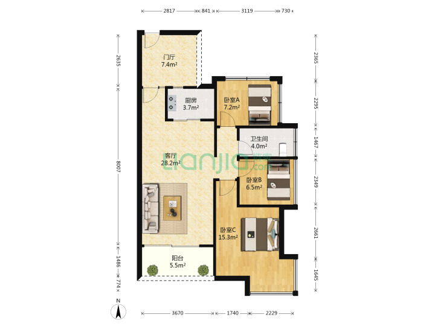

## 龙城广场站

## 三室

> 1.区域：[龙岗中心城 汇龙天下](https://sz.lianjia.com/ershoufang/105104136111.html)，三室一厅

| 总价   | 单价  | 面积  | 朝向                | 楼龄      |
| ------ | ----- | ----- | ------------------- | --------- |
| 290 万 | 32251 | 89.92 | 南/简装/电梯/高(26) | 2011/板塔 |

优点：`地铁3号线龙城广场站1.3公里`、`满五唯一`、`学校配套完善`
