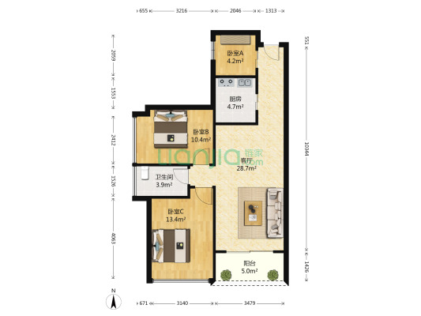

## 双龙站

`3号线`、`16号线（待开通）`

> 2.区域：[双龙 金汐府](https://sz.lianjia.com/ershoufang/105104341680.html)，三室两厅

| 总价   | 单价  | 面积  | 朝向                  | 楼龄      |
| ------ | ----- | ----- | --------------------- | --------- |
| 279 万 | 35917 | 77.68 | 西南/精装/电梯/中(30) | 2015/板塔 |

优点：`地铁3号线双龙站1.52公里`、`学校配套完善`
