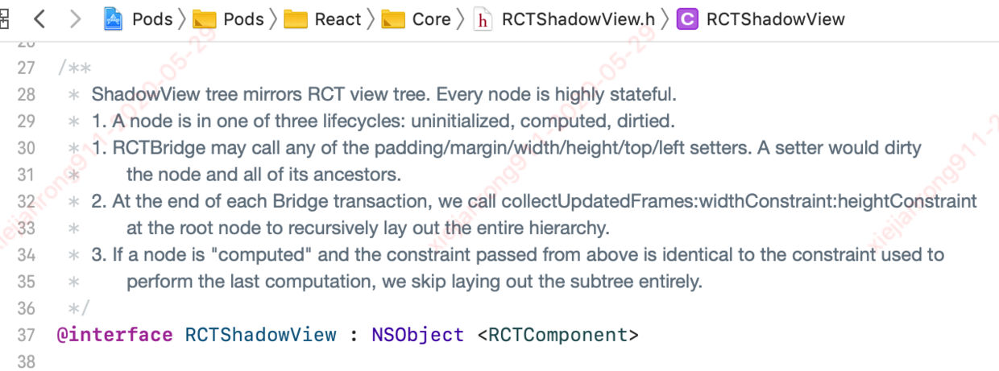
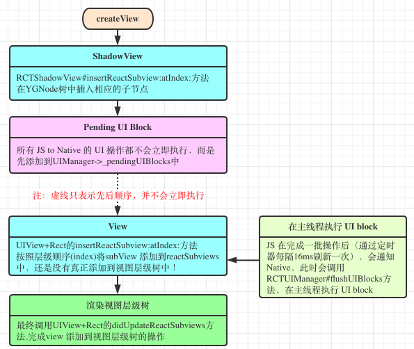
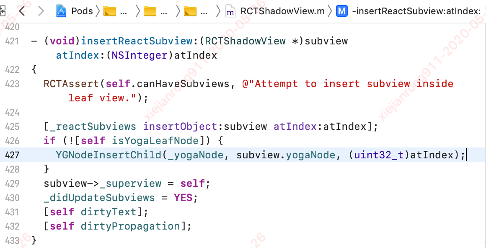
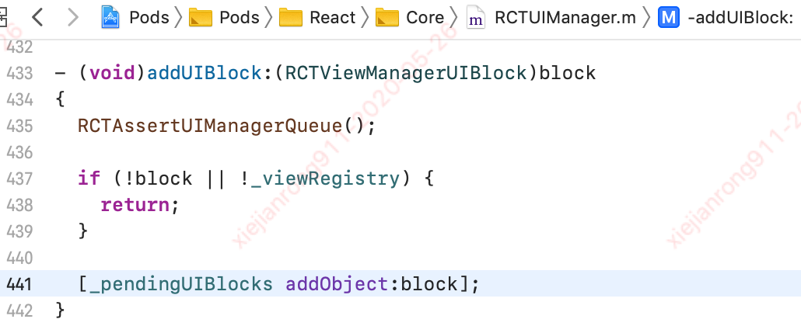
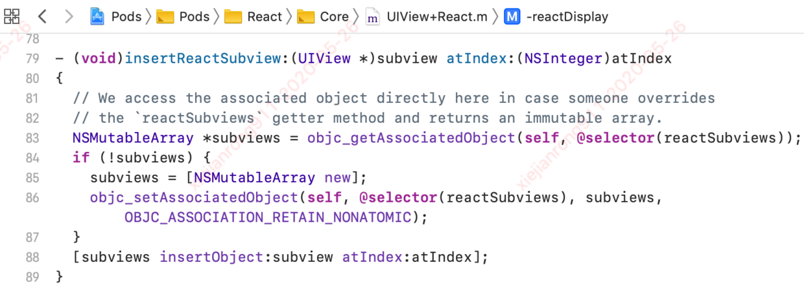
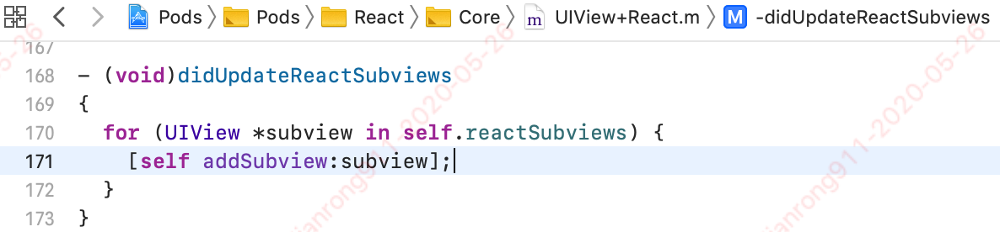
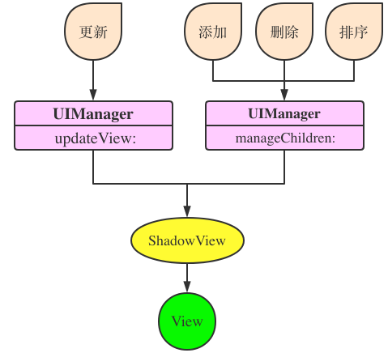
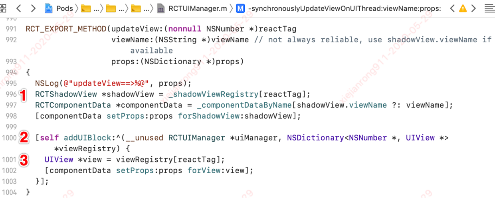
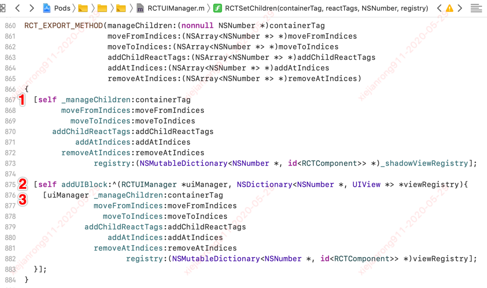

## React-Native Native 层渲染流程{docsify-ignore}

> 所谓 UI 渲染无非就是怎么创建视图，怎么刷新视图。在[ReactNative JS 层渲染之 diff 算法](/resources/rn-diff.md)中，详细介绍了 ReactNative 在 js 端刷新的时候做了什么，我们知道，最后展示在界面上是通过 Native 层渲染的，那 Native 层是如何渲染的呢？

### UIManager

> 在 Native 层渲染中，核心就是`UIManager`和`ShadowView`，这篇文章后续对于创建视图和刷新视图都是围绕 UIManager 和 ShadowView

提供给 RN 的 js 端使用的 UI 组件（如 RNImageView）在创建 View 的同时，都需要创建一个 UIManager（如 RNImageViewManager）负责管理 native 端　和 js 端的通信。在本文中，将详细介绍根视图 RCTRootView 对应的 UIManager。

根视图 RCTRootView 对应的 UIManager 是什么时候创建的呢？

- 1.RCTRootView 在 RN 启动完成后，会进入渲染流程。先创建一个 RCTRootContentView 对象，运行 app 中的 JS 代码，并将创建的 RCTRootContentView 对象作为入口视图容器。代码主流程如下：

```js
- (void)bundleFinishedLoading:(RCTBridge *)bridge
{
 ...
  // 创建一个 RCTRootContentView 对象
  _contentView = [[RCTRootContentView alloc] initWithFrame: bridge: reactTag: sizeFlexiblity:];
  // 运行app的JS代码逻辑
  [self runApplication:bridge];
...
  // 将RCTRootContentView 对象作为入口视图容器
  [self insertSubview:_contentView atIndex:0];
...
}
```

- 2. 在创建 RCTRootContentView 的实例方法中，会触发 UIManager 的实例化和实例方法`registerRootView`。UIManager 中会通过宏`RCT_EXPORT_METHOD()`导出一系列方法给 JS 端调用，用于 JS 端对 OC 端的 View 组件的进行操作，如创建和移除 view，调整 view 的关系，设置 view 的属性等。

```js
- (instancetype)initWithFrame: bridge: reactTag: sizeFlexiblity:
{
  if ((self = [super initWithFrame:frame])) {
  ...
  // UIManager 的实例化
    [_bridge.uiManager registerRootView:self];
  ...
  }
  return self;
}
```

后续介绍 Native 层[如何创建视图]()和[如何刷新视图]()的时候，再详细介绍 UIManager 的几个主要核心功能。

### 什么是 ShadowView？

ShadowView 的官方解释：


简化翻译：

- ShadowView 树就是 RCTView 视图树的镜像，两者是一一对应的关系，ShadowView 保存对应 View 的布局和子控件,管理 View 的加载

- JSBridge 可以调用 ShadowView 中的 setters 方法设置样式等属性。

- 每个 JSBridge 批处理结束，就会调用 `collectUpdatedFrames:widthConstraint:heightConstraint`来刷新整个视图布局。

> 简单来说，Native 层的 ShadowView 类似 js 端的 [VirtualDom]()，主要是用于转换和计算视图布局之类，将计算后的结果，按批刷新视图，防止对真正的视图 View 进行频繁操作，从而提升程序性能。所以，对 ShadowView 的操作一般是在子线程，而对真正视图 View 的操作一定是在主线程

这也是为什么 UIMananger 暴露给 JS 端调用的对视图操作的 API 接口都会同时对 View 和 ShadowView 进行操作

### 如何创建视图？

> JS 端编写的 React 代码是怎么渲染成原生组件的呢？



#### 1. createView

> 启动完成，开始渲染时，通过 UIManager 的方法 `createView:viewName:rootTag:props:`来将 JS 编写的代码映射成 Native 端视图 View。在创建视图时，根据模块名 viewName 和 reactTag 创建 ShadowView，同时在主线程创建与 ShadowView 对应的 View，核心代码实现如下：

```js
RCT_EXPORT_METHOD(createView:viewName:rootTag:props:)
{
  // 1.通过模块名viewName，获取模块配置信息componentData
  RCTComponentData *componentData = _componentDataByName[viewName];
 ...
  // 2.根据模块配置信息，创建 shadowView
  RCTShadowView *shadowView = [componentData createShadowViewWithTag:reactTag];
  // 设置属性并注册shadowView
  [componentData setProps:props forShadowView:shadowView];
  _shadowViewRegistry[reactTag] = shadowView;
  ...
  // 3.根据模块配置信息，创建 view
  RCTExecuteOnMainQueue(^{
   ...
    UIView *view = [componentData createViewWithTag:reactTag];
    // 设置属性并注册view
    [componentData setProps:props forView:view];
    uiManager->_viewRegistry[reactTag] = view;
   ...
  });
}
```

#### 2. setChildren

> 在调用`createView:viewName:rootTag:props:`方法后，会紧接着触发`setChildren:reactTags:`方法来渲染子视图，该方法主要做三件事，代码实现如下：


##### 2.1 shadowView

> RCTShadowView `insertReactSubview:atIndex:`方法，在 YGNode 树中插入相应的子节点，此时，并没有添加到视图层级树中！代码实现如下：



##### 2.2 pendingUIBlocks

> 所有 JS to Native 的 UI 操作都不会立即执行，而是调用`addUIBlock:`将 UI 变化添加队列`_pendingUIBlocks`，等待合适的时机再按批执行队列。代码实现如下：



##### 2.3 View

> UIView+Rect 的 `insertReactSubview:atIndex:`方法
> 按照层级顺序(index)将 subView 添加到 reactSubviews 中，此时，还是没有真正添加到视图层级树中！ 代码实现如下：



#### 3. flushUIBlocks

> JS 在完成一批操作后（通过定时器每隔 16ms 调用一次），会调用 RCTUIManager 的 `flushUIBlocks` 方法，在主线程执行 UI block。代码实现如下：

```js
- (void)flushUIBlocks
{
  // First copy the previous blocks into a temporary variable, then reset the
  // pending blocks to a new array. This guards against mutation while
  // processing the pending blocks in another thread.
  NSArray<RCTViewManagerUIBlock> *previousPendingUIBlocks = _pendingUIBlocks;
  _pendingUIBlocks = [NSMutableArray new];

  if (previousPendingUIBlocks.count) {
    // Execute the previously queued UI blocks
    RCTExecuteOnMainQueue(^{
      for (RCTViewManagerUIBlock block in previousPendingUIBlocks) {
        block(self, self->_viewRegistry);
      }
      ...
    });
  }
}
```

#### 4. didUpdateReactSubViews

> 执行 flushUIBlocks 方法后，最终会调用 UIView+Rect 的 `didUpdateReactSubviews` 方法,完成 View 添加到视图层级树的操作。代码实现如下：



### 如何刷新视图？



#### 1. updateView

> JS 端`setState`后，当属性等发生变化时，JS 端通过 diff 算法计算后，将变化后的属性通过 UIManager 的`updateView`方法更新界面，源码如下：



与[createView](/react-native/rn-native-render?id=_1-createview)和[setChildren](/react-native/rn-native-render?id=_2-setchildren)类似，主要做三件事

```
1. 更新ShadowView的props
2. 将 UI 变化添加队列 _pendingUIBlocks
3. 更新View的props
```

#### 2. manageChildren

> JS 端`setState`后，如果新旧 [Virtual DOM](react-native/rn-diff?id=virtual-dom-概述) 的节点发生增加，删除，排序等节点变化，则 JS 端通过 diff 算法计算后，是通过 UIManager 的`manageChildren`方法更新界面的，源码如下：



与[createView](/react-native/rn-native-render?id=_1-createview)、[setChildren](/react-native/rn-native-render?id=_2-setchildren)、[updateView](/react-native/rn-native-render?id=_1-updateview)类似，主要做三件事

```
1. 更新ShadowView （调用 RCTShadowView `insertReactSubview:atIndex:`方法）
2. 将 UI 变化添加队列 _pendingUIBlocks
3. 更新View （调用 UIView+Rect 的 `insertReactSubview:atIndex:`方法）
```
