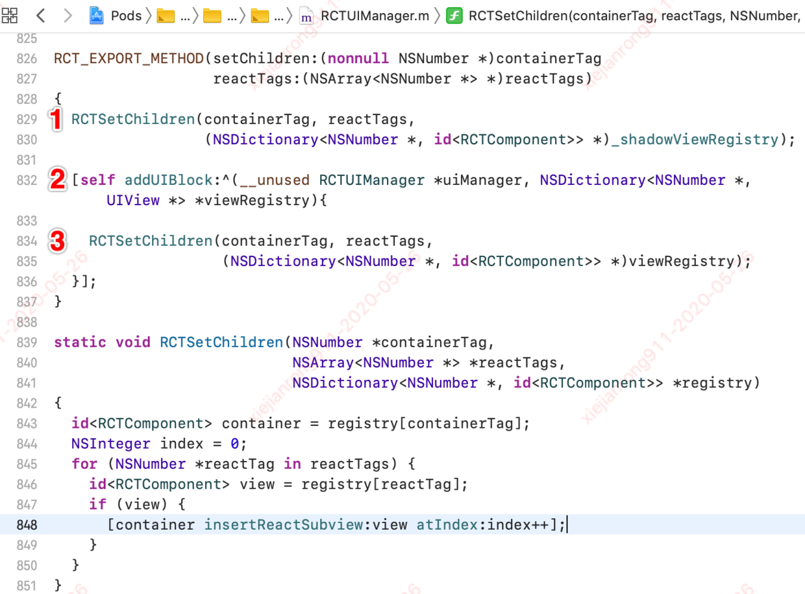

## React-Native 原生层渲染流程{docsify-ignore}

所谓 UI 渲染无非就是怎么创建视图，以后刷新视图的时候怎么刷新。

### UIManager

RCTRootView 在 RN 启动完成后，会进入渲染流程。先创建一个 RCTRootContentView 对象，运行 app 中的 JS 代码，并将创建的 RCTRootContentView 对象作为入口视图容器。代码主流程如下：

```js
- (void)bundleFinishedLoading:(RCTBridge *)bridge
{
 ...
  // 创建一个 RCTRootContentView 对象
  _contentView = [[RCTRootContentView alloc] initWithFrame: bridge: reactTag: sizeFlexiblity:];
  // 运行app的JS代码逻辑
  [self runApplication:bridge];
...
  // 将RCTRootContentView 对象作为入口视图容器
  [self insertSubview:_contentView atIndex:0];
...
}
```

在创建 RCTRootContentView 的实例方法中，会触发 UIManager 的实例化和实例方法`registerRootView`。UIManager 中会通过宏`RCT_EXPORT_METHOD()`导出一系列方法给 JS 端调用，用于 JS 端对 OC 端的 View 组件的进行操作，如创建和移除 view，调整 view 的关系，设置 view 的属性等。

```js
- (instancetype)initWithFrame: bridge: reactTag: sizeFlexiblity:
{
  if ((self = [super initWithFrame:frame])) {
  ...
  // UIManager 的实例化
    [_bridge.uiManager registerRootView:self];
  ...
  }
  return self;
}
```

### 什么是 shadowView？

shadowView 的官方解释：


简化翻译：

- ShadowView 树就是 RCTView 视图树的镜像，两者是一一对应的关系，ShadowView 保存对应 UIView 的布局和子控件,管理 UIView 的加载

- JSBridge 可以调用 ShadowView 中的 setters 方法设置样式等属性。

- 每个 JSBridge 批处理结束，就会调用 `collectUpdatedFrames:widthConstraint:heightConstraint`来刷新整个视图布局。

这也是为什么 UIMananger 暴露给 JS 端调用的对视图操作的 API 接口都会同时对 View 和 ShadowView 进行操作。

### 如何创建视图？

JS 端编写的 React 代码是怎么渲染成原生组件的呢？


#### createView

启动完成，开始渲染时，通过 UIManager 的方法 `createView:viewName:rootTag:props:`来将 JS 编写的代码映射成 Native 端视图 View。在创建视图时，根据模块名 viewName 和 reactTag 创建 ShadowView，同时在主线程创建与 ShadowView 对应的 View，核心代码实现如下：

```js
RCT_EXPORT_METHOD(createView:viewName:rootTag:props:)
{
  // 1.通过模块名viewName，获取模块配置信息componentData
  RCTComponentData *componentData = _componentDataByName[viewName];
 ...
  // 2.根据模块配置信息，创建 shadowView
  RCTShadowView *shadowView = [componentData createShadowViewWithTag:reactTag];
  // 设置属性并注册shadowView
  [componentData setProps:props forShadowView:shadowView];
  _shadowViewRegistry[reactTag] = shadowView;
  ...
  // 3.根据模块配置信息，创建 view
  RCTExecuteOnMainQueue(^{
   ...
    UIView *view = [componentData createViewWithTag:reactTag];
    // 设置属性并注册view
    [componentData setProps:props forView:view];
    uiManager->_viewRegistry[reactTag] = view;
   ...
  });
}
```

#### setChildren

在调用`createView:viewName:rootTag:props:`方法后，会紧接着触发`setChildren:reactTags:`方法来渲染子视图，该方法主要做三件事，代码实现如下：



##### shadowView

- RCTShadowView `insertReactSubview:atIndex:`方法，在 YGNode 树中插入相应的子节点，此时，并没有添加到视图层级树中！代码实现如下：


##### pendingUIBlocks

- 所有 JS to Native 的 UI 操作都不会立即执行，而是调用`addUIBlock:`将 UI 变化添加队列`_pendingUIBlocks`，等待合适的时机再按批执行队列。代码实现如下：


##### View

- UIView+Rect 的 `insertReactSubview:atIndex:`方法
  按照层级顺序(index)将 subView 添加到 reactSubviews 中，此时，还是没有真正添加到视图层级树中！
  代码实现如下：
  

#### flushUIBlocks

JS 在完成一批操作后（通过定时器每隔 16ms 调用一次），会调用 RCTUIManager 的 `flushUIBlocks` 方法，在主线程执行 UI block。代码实现如下：

```js
- (void)flushUIBlocks
{
  // First copy the previous blocks into a temporary variable, then reset the
  // pending blocks to a new array. This guards against mutation while
  // processing the pending blocks in another thread.
  NSArray<RCTViewManagerUIBlock> *previousPendingUIBlocks = _pendingUIBlocks;
  _pendingUIBlocks = [NSMutableArray new];

  if (previousPendingUIBlocks.count) {
    // Execute the previously queued UI blocks
    RCTExecuteOnMainQueue(^{
      for (RCTViewManagerUIBlock block in previousPendingUIBlocks) {
        block(self, self->_viewRegistry);
      }
      ...
    });
  }
}
```

#### didUpdateReactSubViews

执行 flushUIBlocks 方法后，最终会调用 UIView+Rect 的 `didUpdateReactSubviews` 方法,完成 View 添加到视图层级树的操作。代码实现如下：


### 如何刷新视图？


#### updateView

JS 端`setState`后，当属性等发生变化时，JS 端通过 diff 算法计算后，将变化后的属性通过 UIManager 的`updateView`方法更新界面，源码如下：


主要做三件事

```
1. 更新ShadowView的props
2. 将 UI 变化添加队列 _pendingUIBlocks
3. 更新View的props
```

#### manageChildren

JS 端`setState`后，新旧 Virtual DOM 的节点发生增加，删除，排序等节点变化后，JS 端通过 diff 算法计算后，通过 UIManager 的`manageChildren`方法更新界面，源码如下：


与`createView`类似，主要做三件事

```
1. 更新ShadowView （调用 RCTShadowView `insertReactSubview:atIndex:`方法）
2. 将 UI 变化添加队列 _pendingUIBlocks
3. 更新View （调用 UIView+Rect 的 `insertReactSubview:atIndex:`方法）
```
