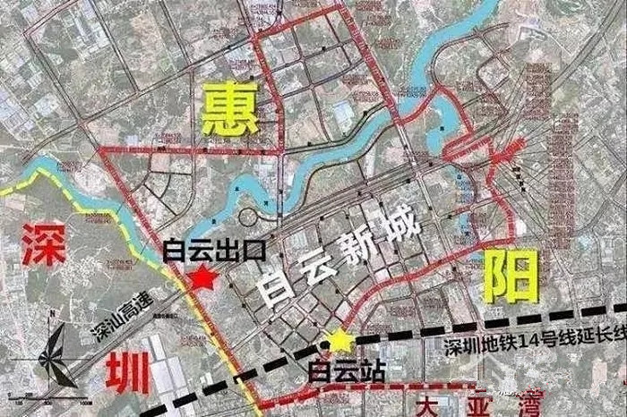

## 惠阳区{docsify-ignore}

`深圳地铁 14 号线`从市中心的福田岗厦北出发，`途径福田、罗湖、龙岗，终点设在距离惠州临深片区 2.3 公里处的坪山沙田站`，通车时间为 2022 年年底，全程 15 个站，运行速度为 120 公里/小时，预计全程跑完在 50 分钟左右。`到了 2022 年`深圳地铁 14 号线深圳段通车后，从深圳市中心到达惠州临深片区，就会成为一个人口大迁移的开始，`惠州临深片区的房价`也将在那个时候`有大的突破`，但是，并不是到那个时候才是最好的买入时机，当下调控渐渐有松动迹象，现在正是抄底未来 2 年深圳与惠州实现基本通勤红利的最佳时期。

### 白云新城

惠阳白云新城东起坪山河东岸，南至白云路，西临惠阳区与深圳市分界线，北临淡水河，规划`配套人口7.8万人`。`白云新城是深圳、惠阳、大亚湾三城交汇地`，与深圳坪山相毗邻，是惠州惠阳区离深圳最近的地方，也是惠阳政府提出“双十战略”对接深圳 1.4 万亿一站式东进的桥头堡。作为政府重点打造的 10 个“产业·城市·人居”融合新片区之一，加上 `14 号线惠州段白云站的规划`受到越来越多购房者的青睐，正承接越来越多的人口流入。

片区未来将再新增 `8 所幼儿园`，`1 所小学`，`1 所 9 年一贯制学校`。此外，将在现有基础上再增加 `2 所医疗服务中心`，`3 个文娱中心`，包括 `1 个老年活动中心`的基础生活配套。

#### 恒大棕榈岛

位于`惠阳行政区与白云新区宜居居住板块交界处`，`靠近深圳地铁 14 号线惠州段第一站白云站`，`距离深圳坪山不到 3 公里`，畅享深惠双城生活；多维立体交通枢纽，城际交通，纵横交错，潮莞、深汕、沿海、惠大，惠盐 5 大高速环绕，畅享深莞惠，珠三角出行无忧；`地铁、高速、高铁三位一体`，共同构筑了未来恒大棕榈岛业主快捷的出行方式，轻松切换城际生活圈。恒大棕榈岛总占地 21 万 ㎡，总建面 41 万 ㎡，容积率 2.4，绿化率高达 40%，由 22 栋高层和 54 栋别墅组成，拥有泰国风情墅区园林，享有 5 大生态景观，自带`棕榈岛中英文学校`、`清恒小学`，更有特色高尔夫课程，是恒大地产集团珠三角公司入驻惠州后倾心筑造的都会高尔夫华宅。

#### 星河盛世

位于紧邻深圳的惠阳区白云新城片区内环路，`靠近深圳地铁14号线惠州第一站白云站`，`距离深圳坪山不到 3 公里`，未来发展和升值空间巨大。星河盛世总占地面积约 8 万，建筑面积达到 35 万，其中住宅面积为 24 万，沿街商业面积 1.8 万，容积率 3.25，绿化率超 30%。无论是投资还是刚需，星河盛世都是置业者优先选择的对象。

#### 保利阳光城

位于惠阳区淡水内环路西侧，是中国央企地产综合实力第一品牌，`离深圳只有 2.3 公里`，`离地铁 14 号线白云站只有 1.5 公里`。总建面约 100 万 ㎡，项目共分四期开发，仅 1/4 深圳房价，占临深头排，一站高铁入深.除了紧邻棕榈岛高尔夫优质资源外，项目依托淡水河优势，打造惠阳美的河畔公园，实现内外公园体系的交相辉映，把家放在公园里。

#### 后浪悦府

位于惠阳白云坑白云路主干道上，`距离深圳沙田地铁站仅2.4公里`，`距离白云地铁站仅仅200米`，是一个真正的地铁口物业！项目`占据坪山新区、惠阳区、大亚湾区三城核心位置`，三大区域交通枢纽（高速、高铁、地铁）多维立体交通路网畅达深圳各个区域，畅享深惠同城生活。作为深圳东进首站，区域优势明显，`往东 15 分钟直通厦深高铁惠州南站`，`往西直接接驳坪山新区丹梓东路，15 分钟车程直通坪山站`，四通八达的交通路网，可轻可切换深惠两城生活。无论是投资还是自住，后浪悦府都是您无与伦比的选择。

#### 水悦华府

`位于惠阳区政府旁`，坐拥千亿市政配套，项目总占地面积 2.5 万 ㎡，总建筑面积 11.7 万 ㎡，小区共有 8 栋建设，其中 7 栋高层住宅和 1 栋写字楼组合，绿化率高达 35%，`周边多轨道交通通行深惠`，`四大商业中心环伺`，出门即享 33 万 ㎡ 湿地公园，与原生湖畔相邻而居，限时钜惠抢购中。

#### 新力睿园

位于大亚湾龙海一路主干道旁，`距离深圳坪山坑梓 1 公里距离`，`离深圳 14 号线沙田地铁口仅 3 公里`，`离 14 号线延长线白云站 800 米`。项目处于惠阳区淡水重点开发的白云新城片区，也是`惠阳、大亚湾、深圳坪山三个地区交界中心点`。项目为 14 万 ㎡ 精品质住区，住宅由 8 栋 10 个单元的高层住宅组成。秉承“深惠标杆”的理念，打造的 360 度双园生态林社区。

### 南站新城
